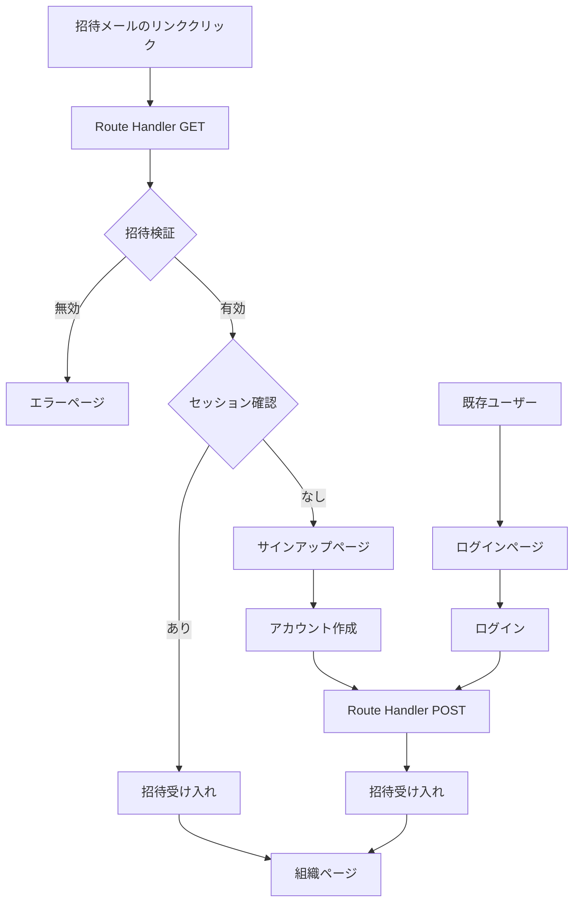

# 組織招待フロー実装記録

## 概要
Better Authの組織プラグインを使用した招待受け入れフローの実装。Route Handlerを使用して、未認証ユーザーでも招待リンクからシームレスに組織に参加できるシステムを構築。

## 実装日
2025-10-10

## 背景と課題

### 初期状態の問題点
1. **middleware.tsによるアクセス制限**
   - セッションがないユーザーはプライベートルートにアクセス不可
   - `/accept-invitation/[id]`ページが認証必須となり、招待リンクが機能しない

2. **UXの問題**
   - 招待情報（組織名、招待者）が表示されない
   - 新規ユーザーが招待の内容を理解できない

3. **セキュリティ**
   - 招待の有効期限チェックなし
   - 既に受け入れ済みの招待の処理なし

## 解決方針

Route Handler（`/api/auth/accept-invitation`）を使用して招待検証を行い、適切な画面へ誘導する方式を採用。

### 選定理由
- Route HandlerはMiddlewareの対象外（`/api`パスは除外）
- 未認証でもアクセス可能
- サーバー側で招待検証を安全に実行可能

## 実装内容

### 1. Route Handler (`/app/api/auth/accept-invitation/route.ts`)

#### GET メソッド
招待リンクからのアクセスを処理：

```typescript
// 主な処理フロー
1. 招待IDの検証
2. 招待情報の取得（Better Auth API使用）
3. 有効性チェック（存在確認、期限、ステータス）
4. セッション確認
5. 分岐処理：
   - 既存ユーザー → 即座に招待受け入れ → 組織ページへ
   - 新規ユーザー → サインアップページへ（招待情報を一時保存）
```

#### POST メソッド
認証後の招待受け入れ処理：

```typescript
// サインアップ/ログイン完了後に呼び出される
1. セッション確認
2. 招待を受け入れ（Better Auth API）
3. 組織IDを返却
```

### 2. サインアップページ

#### ページコンポーネント (`/app/(auth)/signup/page.tsx`)
```typescript
// URLパラメータから招待情報を受け取り
searchParams: {
  invitation?: string;  // 招待ID
  email?: string;       // 招待されたメールアドレス
  org?: string;         // 組織名
  inviter?: string;     // 招待者名
}
```

#### サインアップフォーム (`/components/signup/signup-form.tsx`)
主な機能：
- 招待情報の表示（組織名、招待者）
- メールアドレスの読み取り専用設定（招待時のメール固定）
- アカウント作成後の自動招待受け入れ
- 成功後の組織ページへの自動遷移

### 3. ログインページの更新 (`/components/login/login-form.tsx`)

追加機能：
- 招待経由のログインを検出
- 保留中の招待の自動処理
- エラーメッセージ表示（無効、期限切れ、受け入れ済み）
- サインアップページへの適切なリンク

### 4. 設定ファイルの更新

#### middleware.ts
```typescript
const publicRoutes = [
  "/login",
  "/signup",  // 追加：サインアップページを公開ルートに
  // ...
];
```

#### auth.ts
```typescript
organization({
  async sendInvitationEmail(data) {
    // Route Handler経由の新しいURL形式
    const inviteLink = `${getBaseURL()}/api/auth/accept-invitation?id=${data.id}`;
    // ...
  }
})
```

## 処理フロー



## セキュリティ対策

1. **招待トークンの検証**
   - 存在確認
   - 有効期限チェック
   - ステータス確認（既に受け入れ済みでないか）

2. **クッキーの保護**
   - HTTPOnly設定
   - Secure設定（本番環境）
   - SameSite設定
   - 有効期限設定（1時間）

3. **エラーハンドリング**
   - 詳細なエラーメッセージの非表示
   - 適切なリダイレクト
   - ログ記録

## 技術的な考慮事項

### Better Authのセッション管理

1. **セッション生成のタイミング**
   - `NextResponse.redirect()`だけではセッションは生成されない
   - Better AuthのAPI（signIn、signUp等）を呼び出す必要がある
   - `headers`を渡すことでクッキーが設定される

2. **招待受け入れの権限**
   - セッションが必要（認証済みユーザーのみ）
   - メールアドレスの一致確認は不要（Better Auth側で処理）

### パフォーマンス最適化

1. **Server Component活用**
   - 初期表示でのデータ取得はサーバー側で実行
   - クライアントのローディング時間削減

2. **並列処理**
   - 複数のAPI呼び出しを並列実行
   - Promise.allの活用

## 今後の改善案

1. **メール検証の追加**
   - `requireEmailVerificationOnInvitation`オプションの活用
   - メール確認フローの実装

2. **組織フックの実装**
   ```typescript
   organizationHooks: {
     afterAcceptInvitation: async ({ member, user, organization }) => {
       // ウェルカムメール送信
       // デフォルトリソースの作成
       // 分析イベントの送信
     }
   }
   ```

3. **招待の再送信機能**
   - 期限切れ招待の再発行
   - 招待履歴の管理

4. **ロール別の招待**
   - admin、member等のロール指定
   - 権限に応じた初期設定

## トラブルシューティング

### よくある問題と解決方法

1. **招待リンクが機能しない**
   - middleware.tsでパスが除外されているか確認
   - Route HandlerのURLが正しいか確認

2. **セッションが作成されない**
   - Better Auth APIに`headers`を渡しているか確認
   - 認証APIの戻り値を確認

3. **招待受け入れ後のリダイレクトが失敗**
   - 組織IDが正しく取得できているか確認
   - クライアント側のルーティング設定を確認

## 参考資料

- [Better Auth Organization Plugin Documentation](https://www.better-auth.com/docs/plugins/organization)
- [Next.js Route Handlers](https://nextjs.org/docs/app/building-your-application/routing/route-handlers)
- [Next.js Middleware](https://nextjs.org/docs/app/building-your-application/routing/middleware)

## 変更履歴

- 2025-10-10: 初回実装
  - Route Handlerベースの招待フロー
  - サインアップ/ログインページの招待対応
  - セキュリティ強化（有効期限、ステータスチェック）