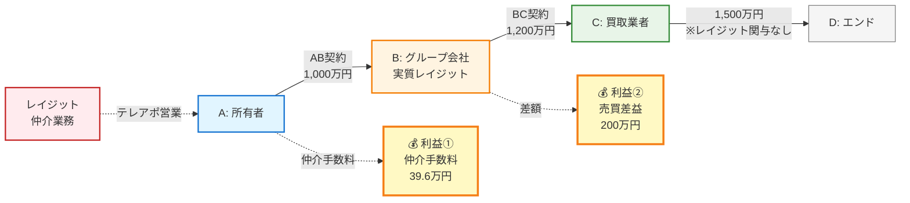
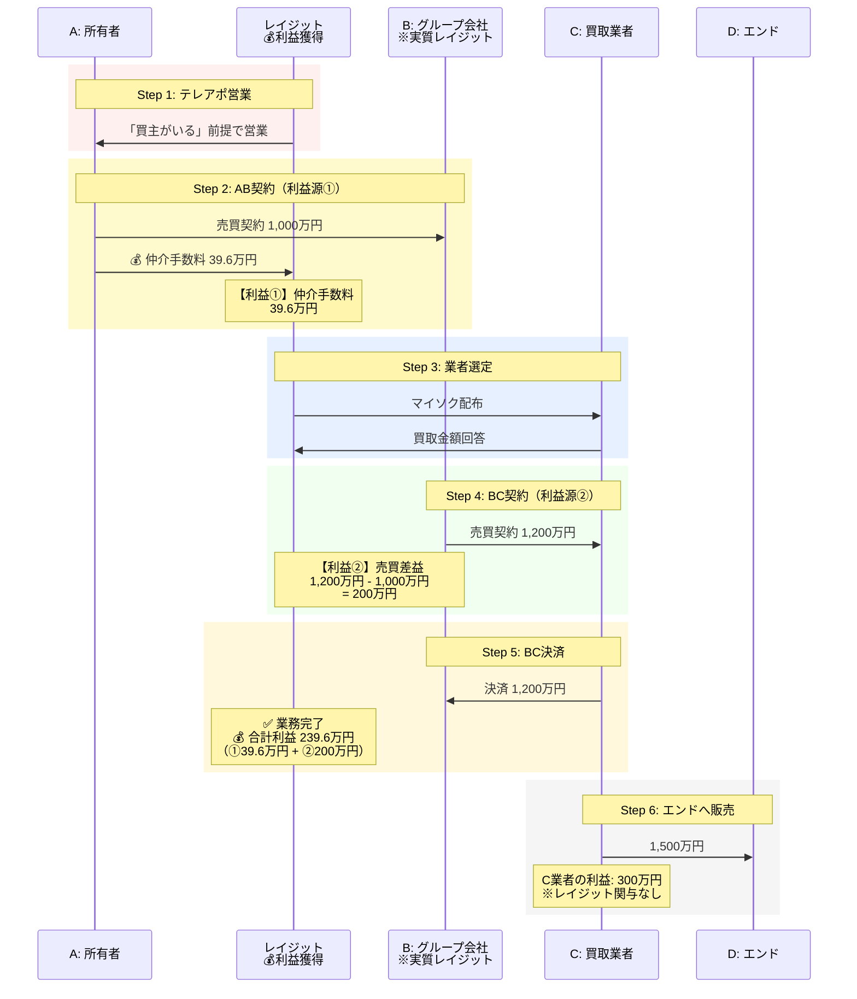

# 案件管理システム MVP要件定義書（顧客向け）

## バージョン情報

- **作成日**: 2025-10-14
- **バージョン**: 1.0
- **対象フェーズ**: MVP（最小限の機能を実装した初期バージョン）

---

## 1. システム概要

### 1.1 目的

1R投資用マンションの物上げ業務における案件管理を効率化し、現在スプレッドシートやEvernoteで管理している情報を一元管理できるシステムを構築します。

### 1.2 現在の課題

- スプレッドシートで管理しているため、誤って情報を削除してしまうリスクがある
- 案件の進捗状況が分かりにくい
- 複数の場所に情報が分散している（スプレッドシート、Evernote等）
- 手入力が多く、入力ミスが発生しやすい
- 担当者間での情報共有が難しい

### 1.3 システム導入による効果

- 案件情報の一元管理
- 進捗状況の可視化
- 誤削除の防止
- 入力作業の効率化
- 担当者間での情報共有の円滑化
- データの正確性向上

### 1.4 MVP（初期バージョン）で実現すること

MVPでは、以下の2つの主要機能を実装します：

1. **ログイン・組織管理機能**
   - 役割別の組織管理（経営組織・営業組織・事務組織）
   - 社員ごとに権限を設定（管理者・メンバー）
   - 組織ごとにアクセス権限と編集権限を制御
   - 安全なログイン機能

2. **案件管理機能**
   - 案件の登録・編集・削除
   - 進捗状況の管理（業者ステータス・書類ステータス）
   - 案件一覧の表示（BC確定前／月次）
   - 案件詳細の表示
   - 組織による編集制限（事務組織は金額情報の編集不可）

### 1.5 MVP以降に実装検討予定

以下の機能は、初期バージョン（MVP）では実装せず、運用状況を見ながらMVP以降での実装を検討します：

- マイソク作成・業者への一括配布機能
- 営業から事務員への依頼機能
- 書類のアップロード・保存機能
- アラート・リマインダー機能（期限が近づいたら通知する機能）
- レポート・分析機能
- 外部システムとの連携

---

## 2. ビジネスの理解

### 2.1 御社の事業概要

- **主要業務**: 1R投資用マンションの物上げ（既存オーナーへの売却営業）
- **営業手法**: テレアポ
- **収益構造**: 相場以下での仕入れと適正価格での転売による差益

### 2.2 取引の流れ

#### 2.2.1 関係者の定義

- **A**: 所有者（売主）
- **B**: グループ会社（買取会社）
- **C**: 買取再販業者
- **D**: エンド（一般買主）
- **仲介**: レイジット（御社）

#### 2.2.2 取引の全体像と金額の流れ



**レイジットの利益構造**:

| 利益源 | 取引 | 金額 | 備考 |
|--------|-----|------|------|
| 💰 **利益①** | AB契約 | **39.6万円** | Aから受け取る仲介手数料 |
| 💰 **利益②** | BC契約 | **200万円** | Bはグループ会社なので差額がレイジットの利益 |
| 🎯 **合計** | - | **239.6万円** | レイジットの利益（BC決済完了で業務終了） |

**その他**:

- **C業者の利益**: 300万円（1,500万円 - 1,200万円）※レイジットの管理外

**ポイント**:

- レイジットは「買主がいる」という形でAにアプローチ
- Bはグループ会社だがAには説明せず、仲介手数料を取得
- AB間の価格差（200万円）+ 仲介手数料（39.6万円）= レイジットの利益（239.6万円）
- BC決済完了で**レイジットの業務は終了**（CD取引は関与しない）

#### 2.2.3 取引の流れ（時系列）



**レイジットの利益構造**:

| 利益源 | 取引 | 金額 | 説明 |
|--------|-----|------|------|
| **①仲介手数料** | AB契約 | 39.6万円 | Aから受け取る仲介手数料 |
| **②売買差益** | BC契約 | 200万円 | BC間の価格差（B＝グループ会社） |
| **合計利益** | - | **239.6万円** | ①+②の合計 |

**各ステップの詳細**:

| ステップ | 内容 | レイジットの利益 |
|---------|------|----------------|
| 1. 営業アプローチ | テレアポでAに売却を提案 | - |
| 2. AB契約締結 | A→Bへ1,000万円で売却 | 💰 39.6万円（仲介手数料） |
| 3. 買取業者選定 | マイソクを配布し、C業者を選定 | - |
| 4. BC契約締結 | B→Cへ1,200万円で転売 | 💰 200万円（売買差益） |
| 5. BC決済完了 | 決済完了 | **業務終了（合計239.6万円）** |
| 6. エンドへの販売 | C→Dへ1,500万円で販売 | 関与なし |

#### ポイント

- Bは実質的にグループ会社だが、Aには「買主がいる」という形で仲介
- AB間の価格差とAからの仲介手数料が御社の利益
- BC決済完了で御社の業務は終了

### 2.3 利益の計算

#### 利益の計算式

```text
利益 = 出口金額 - A金額 + 仲手等
```

#### 具体例

- AB間: 売買代金 1,000万円 + 仲介手数料 39.6万円
- BC間: 売買代金 1,200万円（仲介手数料込み）
- 御社の利益: 239.6万円（差益200万円 + 仲介手数料39.6万円）

### 2.4 売上計上のルール

**基本ルール**:
当月に契約をした物件を翌月末日までにC業者（買取業者）を確定できれば、当月の売上として計上します。

**具体例**:

- 8月15日契約 → 9月27日にC確定 → 売上計上月: 8月
- 8月15日契約 → 10月3日にC確定 → 売上計上月: 9月

---

## 3. ログイン・組織管理機能

### 3.1 機能の目的

- 社員ごとに権限を設定し、適切な操作のみを許可する
- 組織（部門）ごとにアクセス権限を制御する
- 安全にログインできるようにする

### 3.2 組織の管理

#### 3.2.1 組織とは

組織は、業務上の役割ごとに分けられた部門のようなものです。

**標準的な組織構成**:

- **経営組織**: 経営者・役員が所属
- **営業組織**: 営業担当者が所属
- **事務組織**: 事務担当者が所属

#### 3.2.2 組織の特徴

- 各ユーザーは複数の組織に所属できます
  - 例: 経営者は「経営組織」「営業組織」「事務組織」の全てに所属
  - 例: 営業担当者は「営業組織」のみに所属
- 組織は画面アクセスと編集権限を制御するためのものです

#### 3.2.3 組織の情報

- 組織名（例: 経営組織、営業組織、事務組織）
- 作成日

### 3.3 ユーザー（社員）の管理

#### 3.3.1 ユーザーとは

- 社員一人ひとりがユーザーとして登録されます
- 各ユーザーは自分のメールアドレスとパスワードでログインします
- 各ユーザーは複数の組織に所属できます

#### 3.3.2 ユーザーの情報

- 氏名
- メールアドレス
- パスワード
- プロフィール画像（オプション）
- 所属組織（複数可）

#### 3.3.3 ログイン方法

- メールアドレスとパスワードでログイン
- パスワードを忘れた場合は、メールでリセットリンクを受け取れます
- ログイン後、所属組織が複数ある場合は組織を選択

### 3.4 権限（ロール）の管理

#### 3.4.1 権限の種類

各組織内でのユーザーの権限は、以下の2つのいずれかです：

| 権限 | 呼び方 | 役割 |
|------|--------|------|
| admin | 管理者 | 組織の管理者。メンバーの招待や削除ができる |
| member | メンバー | 組織の一般メンバー |

**補足**: システム全体の管理者（owner）は別途存在しますが、通常の業務では使用しません。

#### 3.4.2 組織と権限の組み合わせ

ユーザーは所属する組織によって、アクセスできる画面や編集できる項目が変わります。

##### 経営組織

**対象**: 経営者、役員

**組織内での権限**: 基本的にadmin（管理者）

**できること**:

- 全ての画面の閲覧
- 全ての案件の閲覧・編集（全項目）
- 全ての案件の削除
- 組織へのメンバー招待
- 売上・利益の集計データの閲覧
- レポート機能の利用（将来実装）

**画面アクセス**:

- ✅ BC確定前案件一覧
- ✅ 月次案件一覧
- ✅ 案件詳細
- ✅ 案件編集（全項目編集可能）
- ✅ 売上レポート（将来実装）

##### 営業組織

**対象**: 営業担当者

**組織内での権限**: admin（管理者）またはmember（メンバー）

**できること**:

- 全ての案件の閲覧
- 案件の作成
- 案件の編集（全項目）
  - 基本情報（物件名、オーナー名、金額等）
  - 契約進捗
  - 書類進捗
  - 決済進捗
- 自分が作成した案件の削除
- 組織へのメンバー招待（adminの場合）
- 自分の担当案件の管理
- 売上・利益の集計データの閲覧

**画面アクセス**:

- ✅ BC確定前案件一覧
- ✅ 月次案件一覧
- ✅ 案件詳細
- ✅ 案件編集（全項目編集可能）

##### 事務組織

**対象**: 事務担当者

**組織内での権限**: admin（管理者）またはmember（メンバー）

**できること**:

- 全ての案件の閲覧
- 案件の編集（一部制限あり）
  - ✅ 契約進捗の更新
  - ✅ 書類進捗の更新
  - ✅ 決済進捗の更新
  - ✅ 備考の編集
  - ⚠️ 金額情報の編集（閲覧のみ、編集は不可）
  - ⚠️ 契約形態・B会社・仲介会社の編集（閲覧のみ、編集は不可）
- 組織へのメンバー招待（adminの場合）

**画面アクセス**:

- ✅ BC確定前案件一覧
- ✅ 月次案件一覧
- ✅ 案件詳細
- ✅ 案件編集（一部項目は閲覧のみ）

#### 3.4.3 編集制限の詳細（事務組織）

事務組織に所属するユーザーが案件編集画面を開いた場合、以下の項目は**閲覧のみ**となり、編集できません：

##### タブ1: 基本情報

- ❌ A金額（閲覧のみ）
- ❌ 出口金額（閲覧のみ）
- ❌ 仲手等（閲覧のみ）
- ❌ 利益（閲覧のみ、自動計算）
- ❌ BC手付（閲覧のみ）
- ❌ 契約形態（閲覧のみ）
- ❌ B会社（閲覧のみ）
- ❌ 仲介会社（閲覧のみ）
- ✅ その他の項目（編集可能）

##### タブ2: 契約進捗

- ✅ 全ての項目（編集可能）

##### タブ3: 書類進捗

- ✅ 全ての項目（編集可能）

##### タブ4: 決済進捗

- ✅ 全ての項目（編集可能）

### 3.5 メンバーの招待機能

#### 3.5.1 招待の流れ

1. 組織の**管理者（admin）**が、新しいメンバーのメールアドレスと権限を指定して招待を送信
2. 招待メールが送信される
3. 招待された人が招待リンクをクリック
4. 既にアカウントがある場合: ログイン後、組織に参加
5. アカウントがない場合: アカウント作成後、組織に参加

#### 3.5.2 招待の有効期限

招待リンクは7日間有効です。期限を過ぎた場合は、再度招待を送信する必要があります。

#### 3.5.3 権限別の招待可能範囲

| 組織内での権限 | 招待できる人 |
|--------------|------------|
| admin（管理者） | 同じ組織のadminまたはmember |
| member（メンバー） | 招待不可 |

### 3.6 複数の組織への所属

1人の社員が複数の組織（会社）に所属することができます。その場合、ログイン後に組織を選択する画面が表示されます。

### 3.7 画面

#### 3.7.1 ログイン画面

- メールアドレスとパスワードを入力してログイン
- 「パスワードを忘れた方」リンク
- 「アカウントをお持ちでない方」リンク

#### 3.7.2 アカウント作成画面

- 氏名、メールアドレス、パスワードを入力
- 組織名（会社名）を入力して新規組織を作成
- メール認証が必要

#### 3.7.3 パスワードリセット画面

- メールアドレスを入力
- リセットリンクがメールで送信される
- リセットリンクから新しいパスワードを設定

#### 3.7.4 組織選択画面

- 複数の組織に所属している場合に表示
- 組織一覧から選択
- 選択後、ホーム画面へ

**注意**: この組織選択の仕組みは、今後の運用状況に応じて変更する可能性があります。例えば、以下のような変更が考えられます：

- 組織を切り替えずに、所属する全組織の権限を同時に適用する方式
- デフォルト組織を設定し、自動的にログインする方式
- その他、より使いやすい方式

#### 3.7.5 組織設定画面

- 組織情報の編集
- 社員一覧表示
- 社員招待機能
- 社員の権限変更・削除機能

---

## 4. 案件管理機能

### 4.1 機能の目的

1R投資用マンションの売買案件を登録・管理し、決済までの進捗を追跡します。

### 4.2 案件の情報

#### 4.2.1 基本情報

| 項目 | 説明 | 必須 |
|------|------|------|
| 物件名 | 物件の名称 | ● |
| 号室 | 部屋番号 | - |
| オーナー名 | オーナー名 | ● |
| 担当 | 担当者（複数選択可能） | ● |

#### 4.2.2 金額情報

| 項目 | 説明 | 必須 |
|------|------|------|
| A金額 | 入口金額（万円単位） | - |
| 出口金額 | 出口金額（万円単位） | - |
| 仲手等 | 仲介手数料等（万円単位） | - |
| 利益 | 自動計算（万円単位） | - |
| BC手付 | BC手付金額（万円単位） | - |

**利益の自動計算**:

```text
利益 = 出口金額 - A金額 + 仲手等
```

#### 4.2.3 契約情報

| 項目 | 説明 | 選択肢 |
|------|------|--------|
| 契約形態 | 契約の形態 | AB・BC / AC / 違約 / 違約予定 / 買仲 / 弁護士 |
| B会社 | B会社名 | M'scompany / ライフインベスト / レイジット / 取引業者 |
| 仲介会社 | 仲介会社名 | レイジット / TOUSEI / アーク / RD / NBF / SHINE TERRACE / エスク / M'scompany |
| 買取業者 | 買取業者名 | 自由入力 |
| 抵当銀行 | 抵当銀行名 | 自由入力 |
| 名簿種別 | リード情報の分類 | 自由入力 |

##### 契約形態の詳細

| 契約形態 | 説明 | 利益の計算 |
|---------|------|-----------|
| AB・BC | 通常の取引パターン。A（所有者）→ B（グループ会社）→ C（買取業者）の流れで取引を行う | AB間の価格差 + 仲介手数料 |
| AC | 直接取引パターン。BをスキップしてA（所有者）から直接C（買取業者）に売却する | 仲介手数料のみ |
| 違約 | 契約後に売主都合等で違約となり、違約金が入金済みの案件 | 違約金 |
| 違約予定 | 違約となることが確定しているが、違約金の入金が未完了の案件 | 違約金（予定） |
| 買仲 | 買取仲介。御社が買主側の仲介として入る取引 | 買主側からの仲介手数料 |
| 弁護士 | 法的な問題が発生し、弁護士案件となったもの。内容証明が届いたり、訴訟を起こしている状態 | 案件による |

#### 4.2.4 日付情報

| 項目 | 説明 |
|------|------|
| A契約日（AB契約日） | AB間の契約日 |
| BC契約日 | BC間の契約日 |
| 決済日 | 決済予定日 |

#### 4.2.5 進捗情報

| 項目 | 説明 |
|------|------|
| 進捗（業務ステータス） | 案件の進行段階 |
| 書類（書類ステータス） | 書類取得の進行段階 |

#### 4.2.6 口座情報

| 項目 | 説明 | 選択肢 |
|------|------|--------|
| 使用口座会社 | 決済で使用する口座の会社 | レイジット / ライフ / エムズ |
| 使用銀行口座 | 決済で使用する銀行口座 | 会社によって異なる |

#### 4.2.7 その他

| 項目 | 説明 |
|------|------|
| 備考 | メモ・注意事項（複数行可能） |

### 4.3 進捗（業務ステータス）

#### 4.3.1 進捗の段階（7段階）

案件は以下の7段階で進行します：

| 段階 | ステータス | 説明 |
|------|-----------|------|
| 1 | BC確定前 | BC業者が確定していない状態 |
| 2 | BC確定 CB待ち | BC業者確定、重説・BC契約書のチェックバック待ち |
| 3 | BC確定 契約待ち | チェックバック完了、BC契約待ち |
| 4 | BC完了 決済日確定待ち | BC契約完了、決済日未確定 |
| 5 | 決済日確定 精算書待ち | 決済日確定、精算書作成中 |
| 6 | 精算書完了 決済待ち | 精算書完了、決済待ち |
| 7 | 決済完了 | 決済完了 |

#### 4.3.2 進捗の流れ

```text
BC確定前
  ↓
BC確定 CB待ち
  ↓
BC確定 契約待ち
  ↓
BC完了 決済日確定待ち
  ↓
決済日確定 精算書待ち
  ↓
精算書完了 決済待ち
  ↓
決済完了
```

### 4.4 書類（書類ステータス）

#### 4.4.1 書類ステータスの段階（3段階）

MVPでは、簡略化した3段階で書類の進捗を管理します：

| 段階 | ステータス | 説明 |
|------|-----------|------|
| 1 | 書類依頼待ち | 書類取得の依頼前 |
| 2 | 書類取得中 | 書類取得の依頼済み、取得中 |
| 3 | 全書類取得完了 | 全ての必要書類の取得完了 |

**注**: 次のバージョンでは、書類ごとの詳細なステータス管理を実装予定です。

### 4.5 契約の進捗管理

#### 4.5.1 概要

案件の契約に関する各種タスクの完了状況を管理します。

#### 4.5.2 AB関係のチェック項目

| 項目 | 説明 |
|------|------|
| 契約書 保存完了 | AB契約書のスキャン・保存完了 |
| 委任状関係 保存完了 | 委任状関係書類の保存完了 |
| 売主身分証 保存完了 | 売主の身分証明書の保存完了 |

#### 4.5.3 BC関係のチェック項目

| 項目 | 説明 |
|------|------|
| BC売契作成 | BC売買契約書の作成完了 |
| 重説作成 | 重要事項説明書の作成完了 |
| BC売契送付 | BC売買契約書の業者への送付完了 |
| 重説送付 | 重要事項説明書の業者への送付完了 |
| BC売契CB完了 | BC売買契約書のチェックバック完了 |
| 重説CB完了 | 重要事項説明書のチェックバック完了 |

#### 4.5.4 チェック済みの表示

チェックを入れた項目には、以下の情報が自動で記録されます：

- チェックした日時
- チェックした人の名前

### 4.6 決済の進捗管理

#### 4.6.1 概要

決済に関する各種タスクの完了状況を管理します。

#### 4.6.2 精算書関係

##### BC精算書

段階で管理（4段階）：

1. 未作成
2. 作成
3. 送付
4. CB完了

##### AB精算書

段階で管理（4段階）：

1. 未作成
2. 作成
3. 送付
4. CR完了

##### ローン計算書

チェックボックスで管理：

- ローン計算書 保存

#### 4.6.3 司法書士関係

| 項目 | 管理方法 |
|------|---------|
| 司法書士依頼 | チェックボックス |
| 必要書類共有 | チェックボックス |
| 本人確認書類 | 段階で管理（発送 > 受取 > 返送） |
| 書類不備なし | チェックボックス |

#### 4.6.4 抵当銀行関係

| 項目 | 管理方法 |
|------|---------|
| 抵当銀行 | 段階で管理（依頼 > 受付完了） |
| 書類不備なし | チェックボックス |
| ローン計算書 保存 | チェックボックス |
| 売主手出し完了 | チェックボックス |

#### 4.6.5 賃貸管理・決済後関係

| 項目 | 管理方法 |
|------|---------|
| 管理解約依頼 | 段階で管理（依頼 > 完了） |
| 保証会社承継 | 段階で管理（依頼 > 完了） |
| 鍵 | 段階で管理（受取 > 発送） |
| 管積 口座振替手続き | 段階で管理（受取 > 発送） |
| 取引台帳記入 | チェックボックス |

### 4.7 案件一覧画面

#### 4.7.1 BC確定前案件一覧

**画面の目的**: BC確定前の案件を一覧表示し、進捗を管理する

**表示される項目**（15項目）:

| # | 項目 | 説明 |
|---|------|------|
| 1 | 担当 | 担当者名（複数の場合、バッジで表示） |
| 2 | 物件名 | 物件の名称 |
| 3 | 号室 | 部屋番号 |
| 4 | オーナー | オーナー名 |
| 5 | A金額 | 入口金額（万円単位） |
| 6 | 出口 | 出口金額（万円単位） |
| 7 | 仲手等 | 仲介手数料等（万円単位） |
| 8 | 利益 | 自動計算された利益額（万円単位） |
| 9 | 契約形態 | 契約の形態 |
| 10 | B会社 | B会社名 |
| 11 | 仲介 | 仲介会社名 |
| 12 | 進捗 | 業務ステータス |
| 13 | 書類 | 書類ステータス |
| 14 | 備考 | メモ・注意事項 |
| 15 | 操作 | 詳細・編集メニュー |

**表示条件**:

- 進捗が「BC確定前」の案件のみ表示

**画面上部の集計表示**:

- 利益見込み合計
- A金額合計
- 件数

**できること**:

- 案件の直接編集（進捗、書類、備考をクリックして変更）
- 案件の詳細表示
- 案件の編集（別ウィンドウで開く）
- 案件の削除
- 並び替え・絞り込み

#### 4.7.2 月次案件一覧

**画面の目的**: 指定した月の決済予定案件および決済完了案件を表示

**タブ構成**:

| タブ名 | 表示される案件 |
|--------|--------------|
| 業者確定後 | BC確定後〜決済待ちまでの案件 |
| 決済完了 | 決済完了済みの案件 |

##### タブ1: 業者確定後

画面上部の集計表示:

- 利益合計
- BC手付合計
- 件数

口座別・決済日別の集計:

- 決済日（曜日付き表示、例: 1/15(水)）
- 出口金額合計（万円単位）
- 件数
- 上限比率（1億円に対する割合）
  - 80%以上: 赤色で表示 + ⚠️マーク
  - 50%以上: 黄色で表示
  - 50%未満: 青色で表示

案件一覧テーブル（18項目）:

| # | 項目 | 説明 |
|---|------|------|
| 1 | 担当 | 担当者名 |
| 2 | 物件名 | 物件の名称 |
| 3 | 号室 | 部屋番号 |
| 4 | オーナー | オーナー名 |
| 5 | A金額 | 入口金額（万円単位） |
| 6 | 出口 | 出口金額（万円単位） |
| 7 | 仲手等 | 仲介手数料等（万円単位） |
| 8 | 利益 | 自動計算された利益額（万円単位） |
| 9 | BC手付 | BC手付金額（万円単位） |
| 10 | 決済日 | 決済予定日（1/15形式） |
| 11 | 買取 | 買取会社名 |
| 12 | 契約形態 | 契約の形態 |
| 13 | B会社 | B会社名 |
| 14 | 仲介 | 仲介会社名 |
| 15 | 進捗 | 業務ステータス |
| 16 | 書類 | 書類ステータス |
| 17 | 備考 | メモ・注意事項 |
| 18 | 操作 | 詳細・編集メニュー |

###### タブ1の表示条件

- 決済日が選択した月の範囲内
- 進捗が「BC確定前」以外

##### タブ2: 決済完了

画面上部の集計表示:

- 利益合計
- BC手付合計
- 件数

案件一覧テーブル:

- 業者確定後タブと同じ項目を表示
- 進捗は全て「決済完了」

###### タブ2の表示条件

- 決済日が選択した月の範囲内
- 進捗が「決済完了」

### 4.8 案件詳細画面

**画面の目的**: 案件の全情報を閲覧する（編集はできません）

**画面の構成**: 左右2列のレイアウト

**左側（広い方）**:

- 金額情報
  - 入口金額（A金額）
  - 出口金額
  - 仲介手数料
  - BC手付
  - **利益見込み**（大きく目立つように表示）

- 契約スケジュール
  - A契約日（AB契約日）
  - BC契約日
  - 決済予定日

- 契約の進捗
  - AB関係のチェック項目
  - BC関係のチェック項目

**右側（狭い方）**:

- 関係者情報
  - 契約形態
  - 買取業者
  - B会社
  - 仲介会社
  - 抵当銀行

- 口座情報
  - 使用口座会社
  - 使用銀行口座

- その他
  - 名簿種別
  - 備考

### 4.9 案件編集ウィンドウ

**目的**: 案件情報を編集する

**ウィンドウのサイズ**: 大きめのウィンドウ（スクロール可能）

**タブ構成**: 4つのタブで情報を整理

#### 4.9.1 タブ1: 基本情報

案件の基本的な情報を入力します。

| 項目 | 入力方法 | 必須 |
|------|---------|------|
| 担当 | 複数選択可能 | ● |
| 物件名 | テキスト入力 | ● |
| 号室 | テキスト入力 | - |
| オーナー名 | テキスト入力 | ● |
| A金額 | 数値入力（万円） | - |
| 出口金額 | 数値入力（万円） | - |
| 仲手等 | 数値入力（万円） | - |
| 利益 | 自動計算（変更不可） | - |
| A契約日 | 日付入力 | - |
| 決済日 | 日付入力 | - |
| 買取業者 | テキスト入力（候補あり） | - |
| 契約形態 | 選択式 | - |
| B会社 | 選択式 | - |
| 仲介会社 | 選択式 | - |
| 抵当銀行 | テキスト入力（候補あり） | - |
| 名簿種別 | テキスト入力 | - |
| 備考 | 複数行のテキスト入力 | - |

#### 4.9.2 タブ2: 契約進捗

契約に関する各種タスクの完了状況を管理します。

**AB関係**:

- 契約書 保存完了（チェックボックス）
- 委任状関係 保存完了（チェックボックス）
- 売主身分証 保存完了（チェックボックス）

**BC関係**:

- BC売契作成（チェックボックス）
- 重説作成（チェックボックス）
- BC売契送付（チェックボックス）
- 重説送付（チェックボックス）
- BC売契CB完了（チェックボックス）
- 重説CB完了（チェックボックス）

**チェック済みの場合**: 日時と誰がチェックしたかが表示されます

#### 4.9.3 タブ3: 書類進捗

MVPでは簡易版を実装します。

- 書類ステータスの選択（3段階）
  - 書類依頼待ち
  - 書類取得中
  - 全書類取得完了

**注**: 次のバージョンでは、書類ごとの詳細なステータス管理を実装予定です。

#### 4.9.4 タブ4: 決済進捗

決済に関する各種タスクの完了状況を管理します。

**左側**:

- 精算書関係
  - BC精算書（段階で管理: 未作成 > 作成 > 送付 > CB完了）
  - ローン計算書 保存（チェックボックス）
  - AB精算書（段階で管理: 未作成 > 作成 > 送付 > CR完了）

- 司法書士関係
  - 司法書士依頼（チェックボックス）
  - 必要書類共有（チェックボックス）
  - 本人確認書類（段階で管理: 発送 > 受取 > 返送）
  - 書類不備なし（チェックボックス）

- 抵当銀行関係
  - 抵当銀行（段階で管理: 依頼 > 受付完了）
  - 書類不備なし（チェックボックス）
  - ローン計算書 保存（チェックボックス）
  - 売主手出し完了（チェックボックス）

- 賃貸管理・決済後関係
  - 管理解約依頼（段階で管理: 依頼 > 完了）
  - 保証会社承継（段階で管理: 依頼 > 完了）
  - 鍵（段階で管理: 受取 > 発送）
  - 管積 口座振替手続き（段階で管理: 受取 > 発送）
  - 取引台帳記入（チェックボックス）

**右側**:

- 口座情報
  - 使用口座会社（選択式）
  - 使用銀行口座（選択式）

- 同日同口座の出口金額合計表示
  - 同じ日に同じ口座を使う案件の出口金額の合計が表示されます
  - 1億円を超える場合は警告が表示されます

**ボタン**:

- キャンセル: 変更を破棄してウィンドウを閉じる
- 保存: 変更を保存してウィンドウを閉じる

### 4.10 案件の新規作成

**作成方法**: BC確定前案件一覧画面、または月次案件一覧画面の「新規作成」ボタンをクリック

**入力画面**: 案件編集ウィンドウと同じフォームを使用

**必須項目**:

- 担当（最低1名）
- 物件名
- オーナー名

**初期値**:

- 進捗: BC確定前
- 書類: 書類依頼待ち
- その他のチェック項目: 全て未チェック

### 4.11 案件の削除

**削除方法**: 案件一覧画面の操作メニューから削除

**確認**: 削除前に確認メッセージが表示されます

**権限**: オーナー、管理者、案件を作成した人のみ削除できます

---

## 5. 画面の流れ

### 5.1 ログインの流れ

```text
ログインしていない状態
  ↓
ログイン画面
  ↓
[ログイン成功]
  ↓
組織選択画面（複数の組織に所属している場合のみ）
  ↓
ホーム画面
```

### 5.2 案件管理の流れ

以下は画面遷移のイメージです。実際の運用状況に応じて変更される可能性があります。

```text
ホーム画面
  ↓
├─ BC確定前案件一覧
│    ↓
│    ├─ 案件詳細
│    │    ↓
│    │    └─ 案件編集ウィンドウ
│    │
│    └─ 案件作成ウィンドウ
│
└─ 月次案件一覧
     ↓
     ├─ 案件詳細
     │    ↓
     │    └─ 案件編集ウィンドウ
     │
     └─ 案件作成ウィンドウ
```

### 5.3 組織管理の流れ

以下は画面遷移のイメージです。実際の運用状況に応じて変更される可能性があります。

```text
ホーム画面
  ↓
組織設定
  ↓
  ├─ 組織情報編集
  │
  ├─ 社員一覧
  │    ↓
  │    ├─ 社員招待
  │    │
  │    ├─ 社員の権限変更
  │    │
  │    └─ 社員の削除
  │
  └─ 組織削除（オーナーのみ）
```

---

## 6. 開発フェーズと機能追加予定

### 6.1 MVP（最小限の機能）

本要件定義書で説明している機能を実装します：

- ログイン・組織管理機能
  - 役割別の組織管理（経営組織・営業組織・事務組織）
  - 社員ごとの権限設定（管理者・メンバー）
  - 組織ごとのアクセス権限と編集権限の制御
  - 安全なログイン機能
- 案件管理機能
  - 案件の登録・編集・削除
  - 進捗状況の管理（業者ステータス・書類ステータス）
  - 案件一覧の表示（BC確定前／月次）
  - 案件詳細の表示
  - 組織による編集制限（事務組織は金額情報の編集不可）

### 6.2 Phase 1で追加予定

- 書類のアップロード・保存機能
- 書類ステータスの詳細化（5段階）
  - 空欄（未対応）
  - 依頼待ち（営業からの依頼待ち）
  - 依頼済み（取得中）
  - 取得完了
  - 書類なし（該当なし）
- 書類ごとの詳細なステータス管理
- チェックバックループの可視化
  - BC契約書・重説のチェックバック待ちステータス
  - 精算書のチェックバック待ちステータス

### 6.3 Phase 2で追加予定

- マイソク作成・業者への一括配布機能
  - URLで送付し、金額回答フォームを作成
  - 業者からの金額回答を自動で反映
  - 金額が高い順に自動並び替え
  - 過去データからの分析機能（業者別平均金額、回答率）
- 営業から事務員への依頼機能
  - 依頼一覧画面
  - 依頼作成・受領機能
  - 依頼ステータス管理
- アラート・リマインダー機能
  - 書類取得期限のアラート
  - 司法書士依頼期限のアラート
  - 賃貸管理解約期限のアラート

### 6.4 Phase 3以降で追加予定

- レポート・分析機能
  - 月次売上レポート
  - 担当者別実績レポート
  - 進捗状況の分析
- ダッシュボードの充実
  - KPI表示
  - グラフ・チャートによる可視化
- 外部システムとの連携
  - 会計システム連携
  - メールシステム連携
  - その他のツール連携
- スマートフォンアプリ化
- AI機能
  - 利益予測
  - 自動査定
  - その他のAI機能

---

## 7. 用語集

| 用語 | 説明 |
|------|------|
| 物上げ | 既存オーナーへの売却営業 |
| A金額 | 入口金額（AB間の売買代金） |
| 出口金額 | BC間の売買代金 |
| 仲手 | 仲介手数料 |
| マイソク | 物件資料 |
| BC | BからCへの取引 |
| AB | AからBへの取引 |
| CB | チェックバック（業者からの内容確認） |
| CR | チェックリスト（上席からの内容確認） |
| 重説 | 重要事項説明書 |
| 賃契 | 賃貸借契約書 |
| 重調 | 重要事項調査報告書 |
| 長計 | 長期修繕計画書 |
| 公課証明 | 固定資産税評価証明書 |

---

最終更新: 2025-10-14
