# システム構成図（Mermaid）

## 1. ビジネスフロー全体像

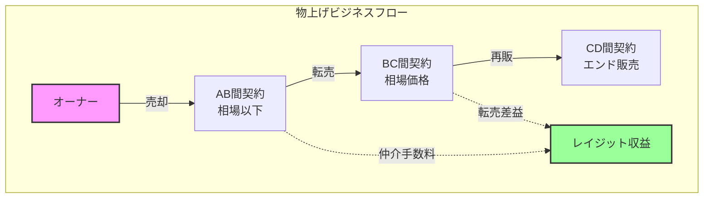

## 2. システムアーキテクチャ

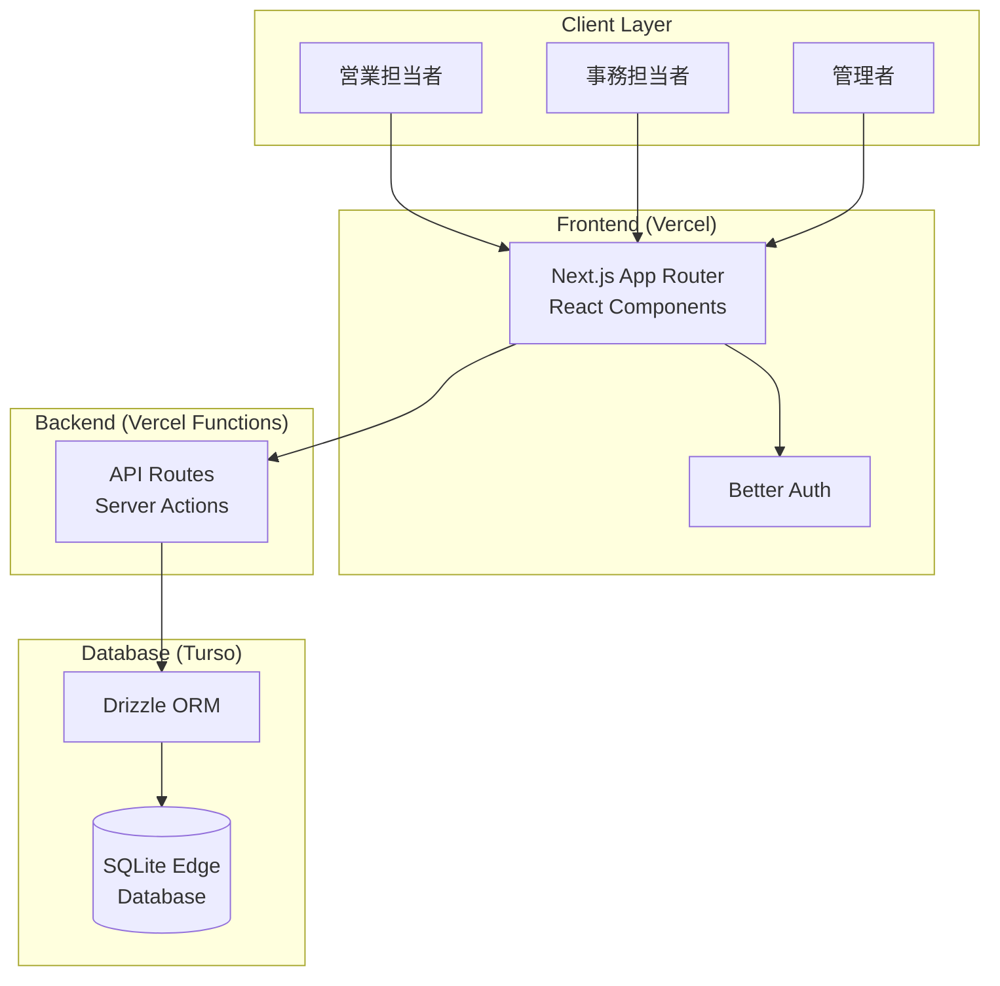

## 3. 決済確定管理機能のユーザージャーニー

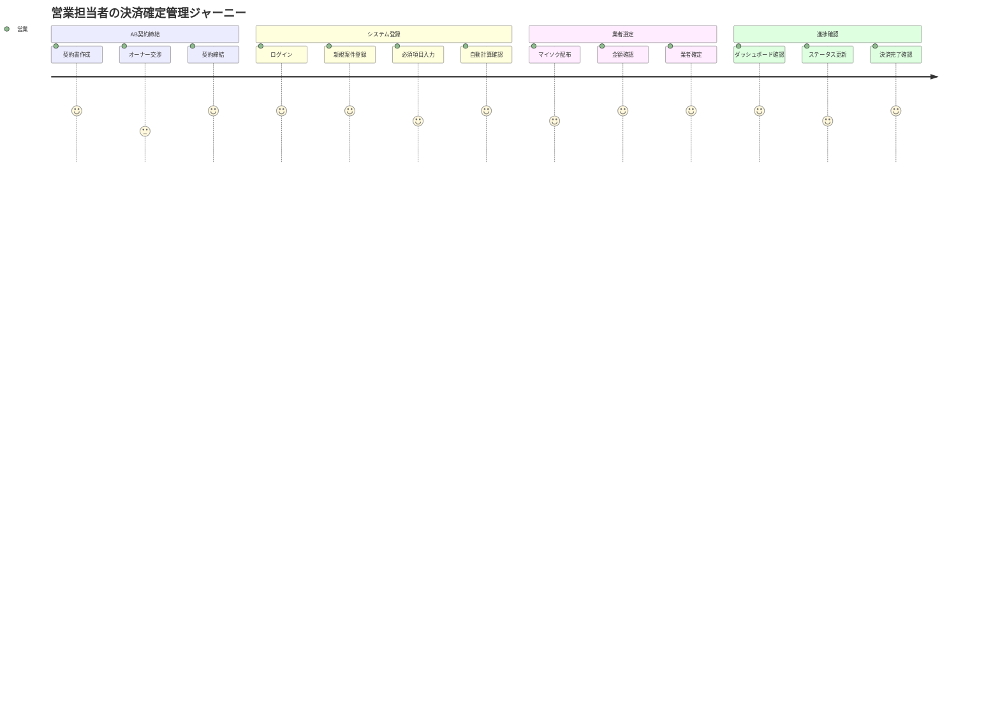

## 4. 調査関係管理の業務フロー

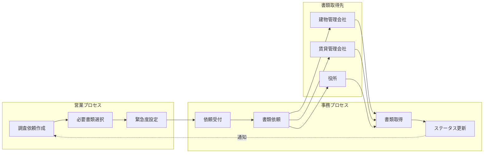

## 5. データモデル（ER図）

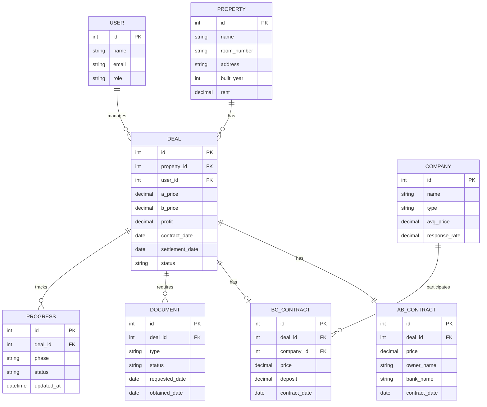

## 6. 画面遷移図

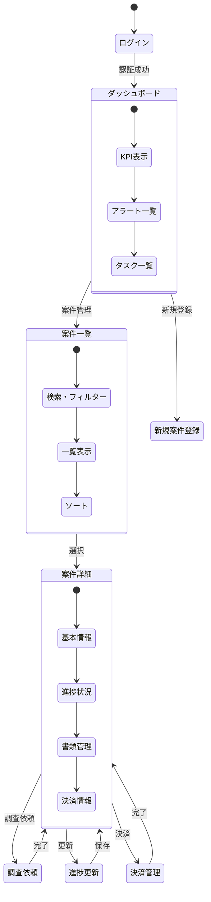

## 7. 決済確定管理の状態遷移

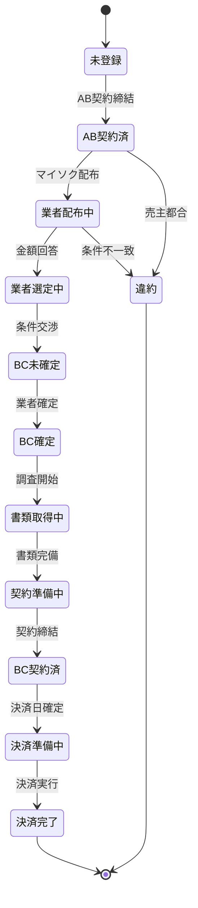

## 8. 調査プロセスの詳細フロー

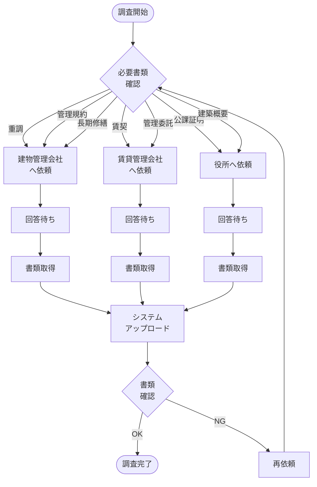

## 9. システム間のシーケンス図

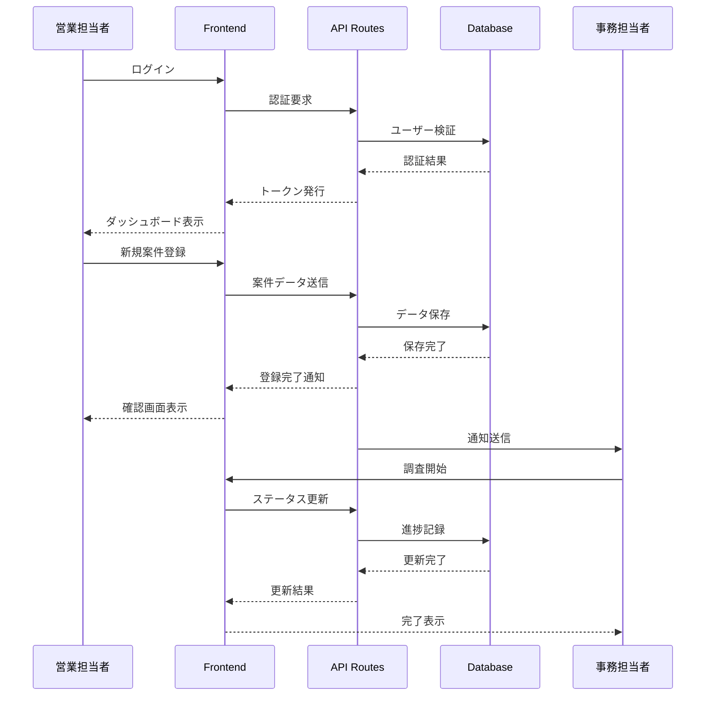

## 10. 業者配布のアクティビティ図

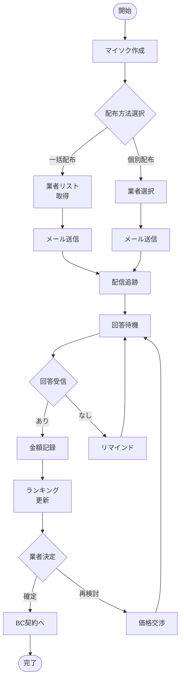

## 11. 売上計上ルールのフローチャート

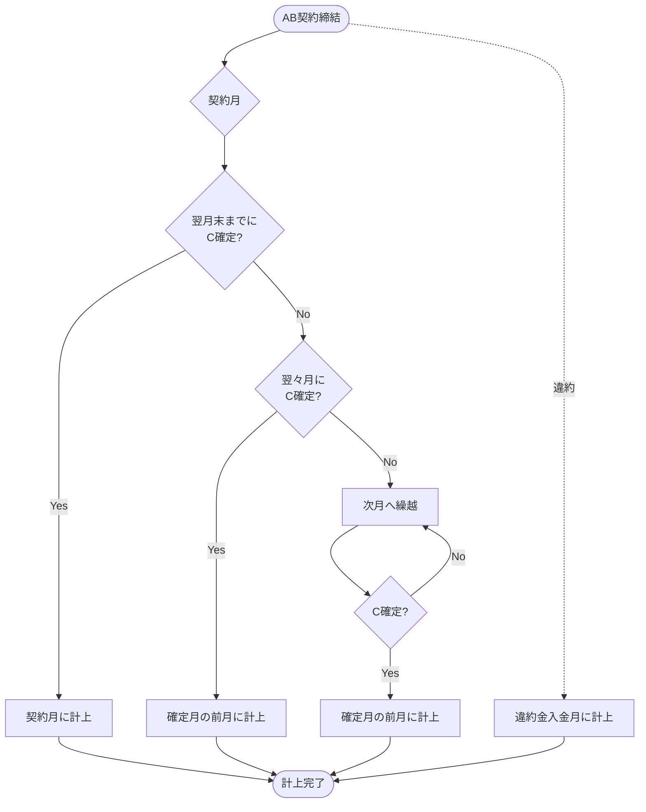

## 12. ユーザーロールと権限マトリクス

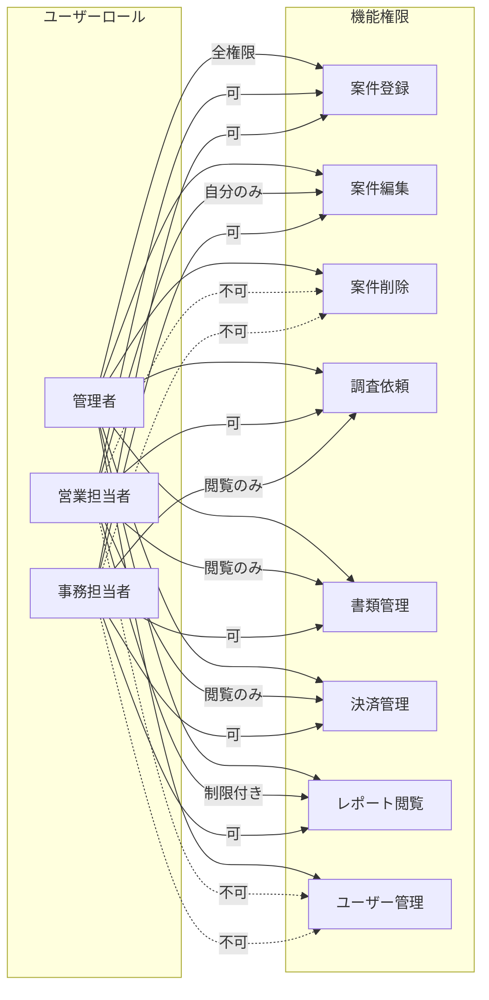

---

**改訂履歴**
- v1.0 - 2025-01-27 - Mermaidダイアグラム作成