# ユーザーストーリー図解（Mermaid）

## 1. 決済確定管理機能 - ユーザーストーリーマップ

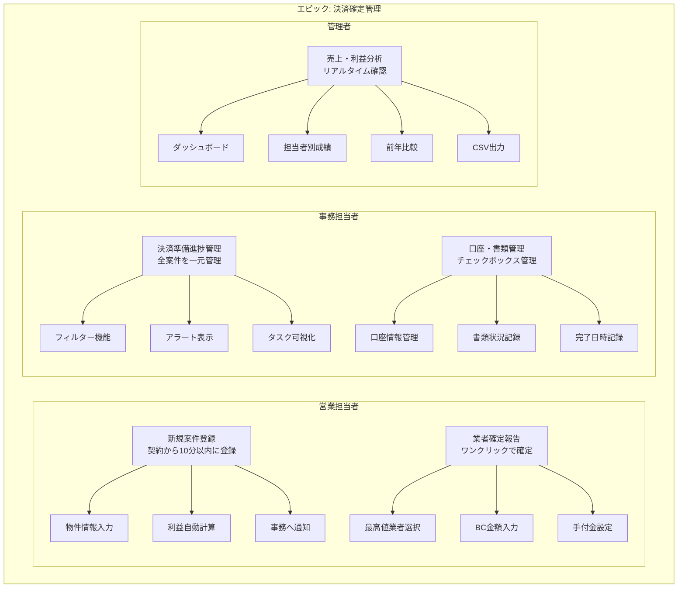

## 2. 調査関係管理機能 - ユーザーストーリーマップ

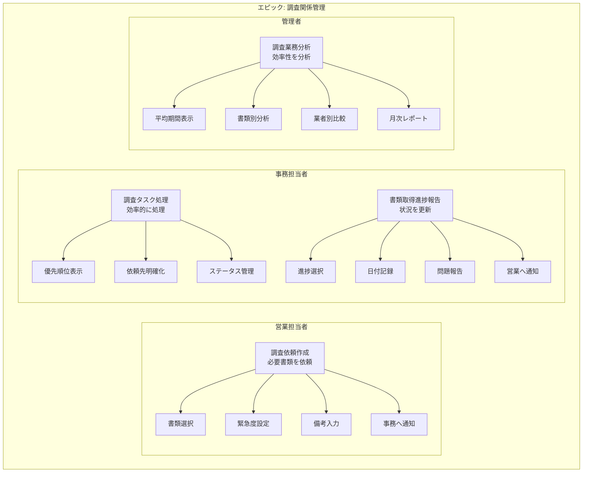

## 3. 営業担当者のユーザージャーニー

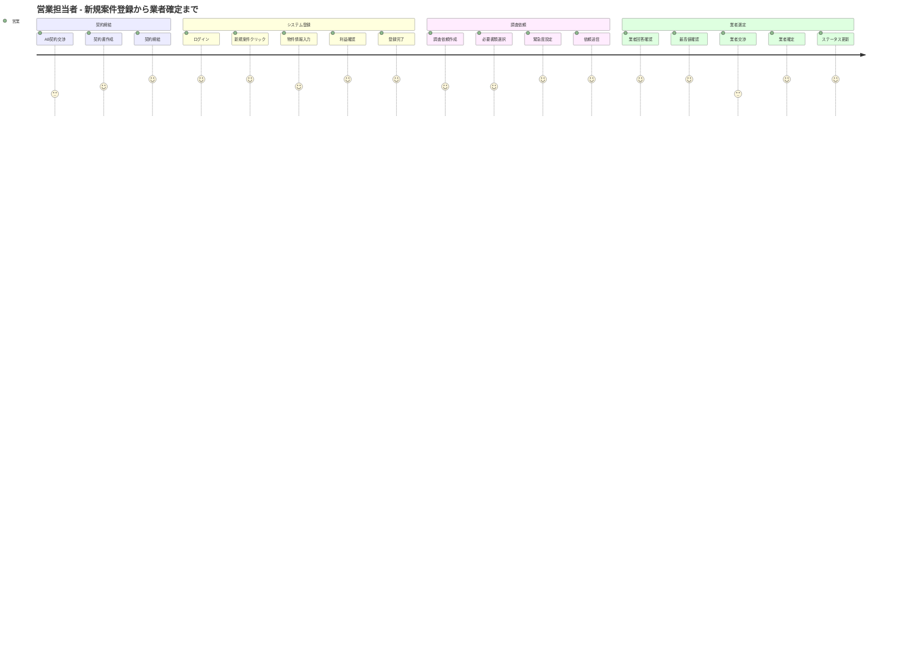

## 4. 事務担当者のユーザージャーニー

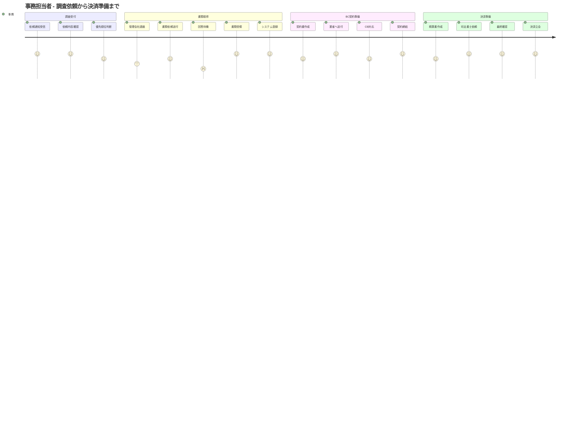

## 5. ストーリー1: 新規案件登録の詳細フロー

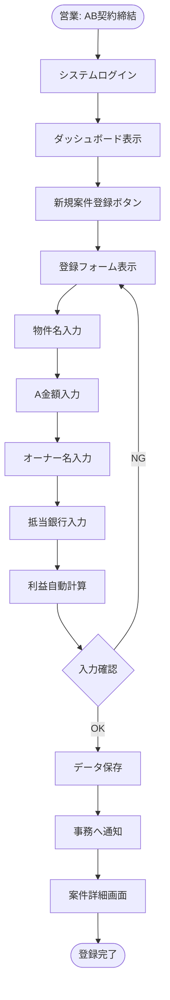

## 6. ストーリー3: 決済準備進捗管理の画面フロー

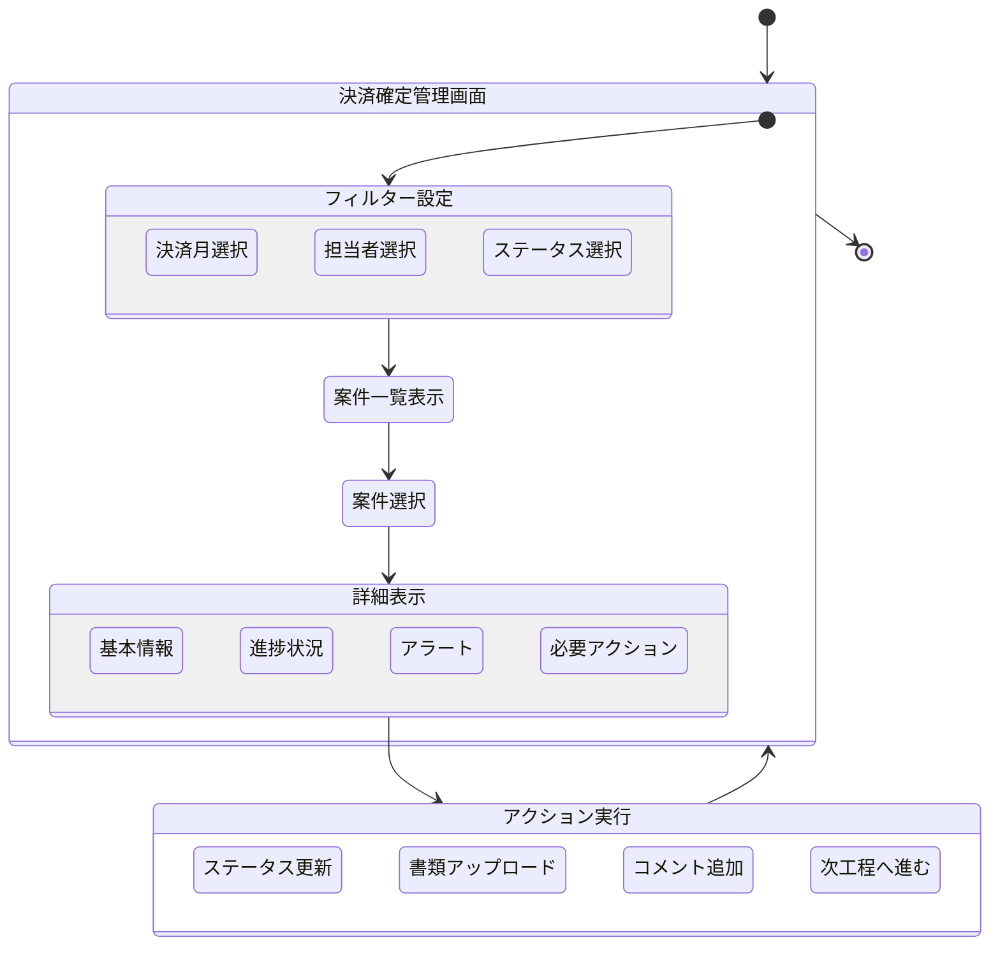

## 7. ストーリー6: 調査依頼作成のシーケンス

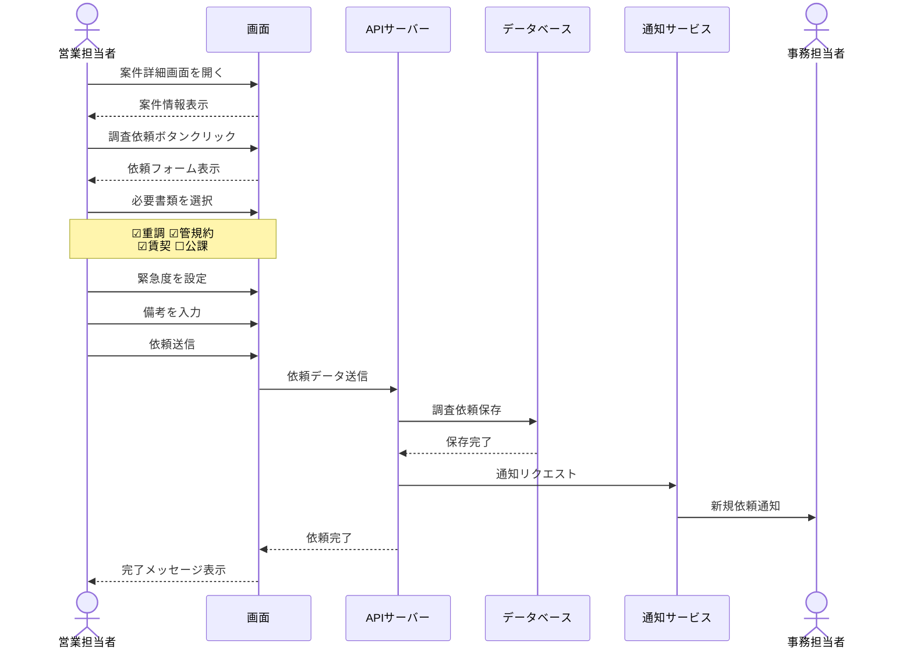

## 8. ストーリー7: 調査タスク処理のアクティビティ

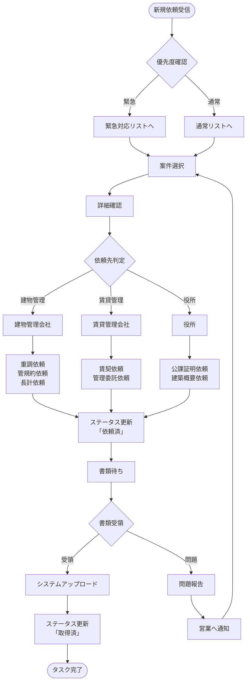

## 9. 決済確定管理の受け入れ基準マトリクス

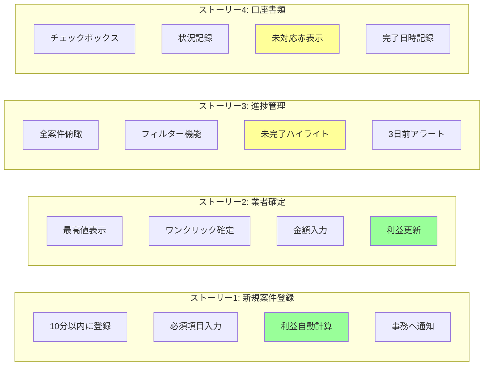

## 10. 調査関係管理の状態遷移

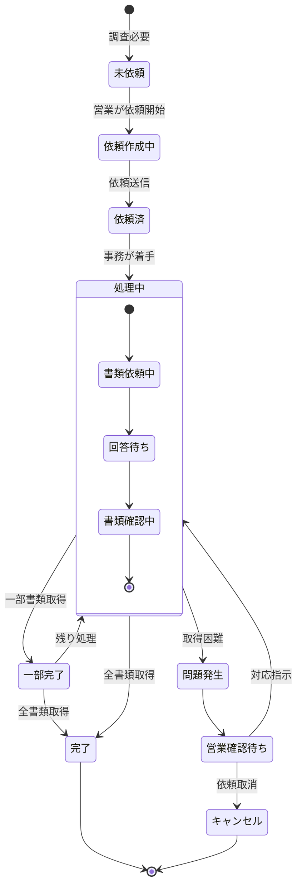

## 11. ユーザーペルソナ別のニーズマップ

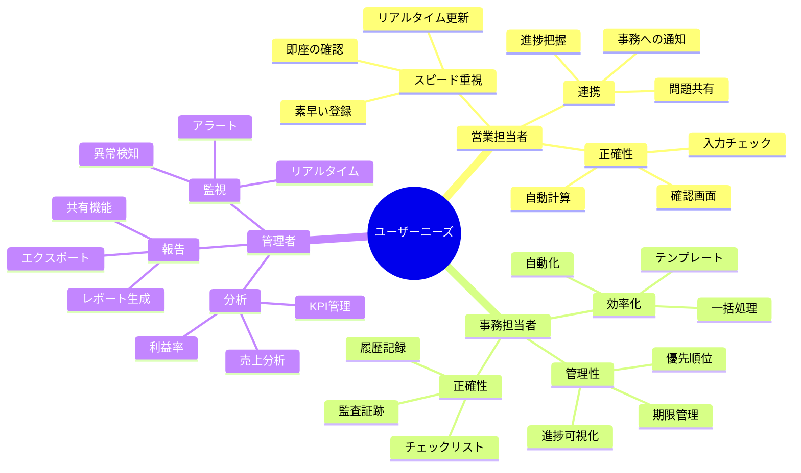

## 12. MVPスコープのユーザーストーリー優先度

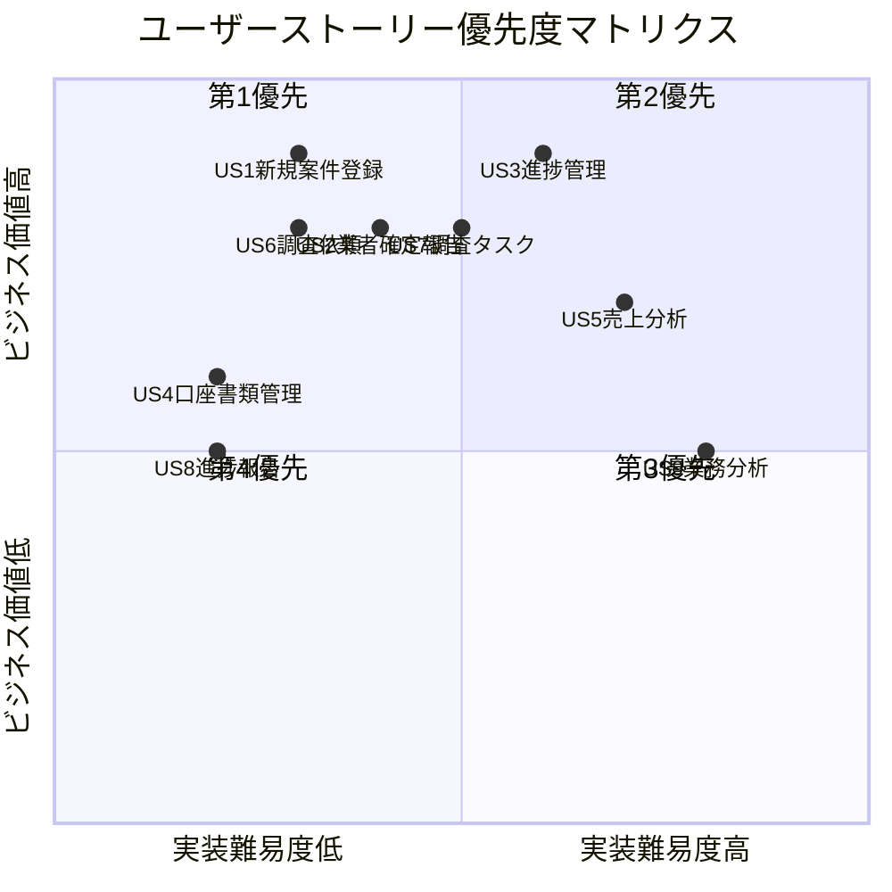

---

**改訂履歴**
- v1.0 - 2025-01-27 - ユーザーストーリーMermaidダイアグラム作成